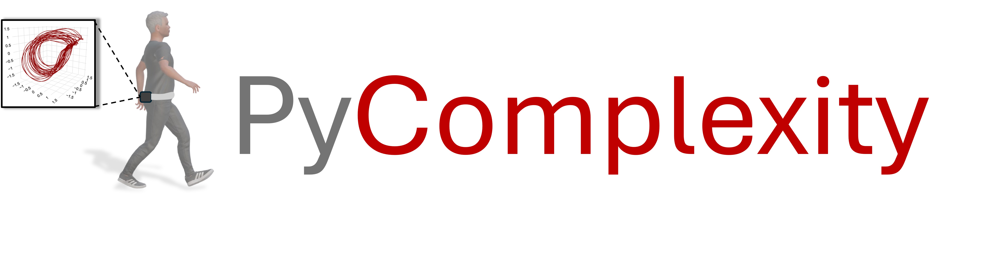
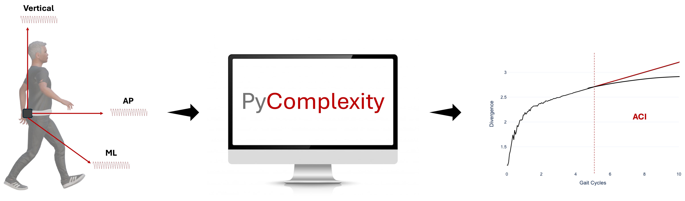

<p align="center">
  
</p>

# Python module for computing the Attractor Complexity Index (ACI), a non-linear measure of gait automaticity

[](https://doi.org/10.5281/zenodo.19324133) <!-- omit in toc -->

The Attractor Complexity Index (ACI) corresponds to the long-term largest Lyapunov exponent derived from gait dynamics. Initially introduced as a measure of gait stability, it is now increasingly recognized as a marker of gait automaticity across conditions of graded complexity.

ACI quantifies the divergence of trajectories in the reconstructed state space, capturing deviations from stereotyped locomotor patterns. These deviations may arise from external perturbations (e.g., auditory cueing) or internal disturbances (e.g., neural dysfunction). As such, ACI provides a compact representation of how gait departs from fully automated control.

This measure is highly promising in geriatrics and neurological populations, where it can serve as a behavioural proxy of alterations in underlying gait control networks.

<p align="center">
  
</p>

PyComplexity implements a suite of core functions commonly used in the estimation of Lyapunov exponents in gait analysis. The current implementation is adapted from the public MATLAB codebase (https://github.com/SjoerdBruijn/LocalDynamicStability). 

This library translates these methods into Python to facilitate broader access to ACI computation in an open-source environment, particularly for researchers with limited resources or technical background.

The current version provides a minimal and reproducible pipeline for deriving ACI from lower-back accelerometer time-series during gait, using fixed embedding parameters.

Planned updates for Summer 2026 will extend the framework to include data-driven phase space reconstruction, with Python implementations of Global False Nearest Neighbours for optimal embedding dimension selection and Average Mutual Information for time delay estimation. These additions will be based on the following MATLAB implementation (https://github.com/danm0nster/mdembedding).


## Installation

```python
pip install PyComplexity
```

## Example

```python
# ACI computation and plot divergence curve fit: 
from PyComplexity import compute_aci
compute_aci(acc_magnitude, hc_frames, n_dim=5, delay=10, ws=12, fs=100, period=1, min_val= 5, plot=True)
```


## How to cite

If you use this package, please cite (mandatory):

Mvomo, C. E. (2025). PyComplexity: A Python module for computing the Attractor Complexity Index (ACI) from lower-back accelerometer time-series during gait (Version v0.1.0). Zenodo. http://doi.org/10.5281/zenodo.19324133  

and:

Mvomo, C. E., Njiki, J. B. S., Leibovich, D., Guedes, C., Potvin-Desrochers, A., Dixon, P. C., Awai, C. E., & Paquette, C. (2026). Gait-Related Digital Mobility Outcomes in Parkinson’s Disease: New Insights into Convergent Validity? medRxiv. https://doi.org/10.64898/2026.03.07.26347847  

You can also cite BibTeX (optional):
```bibtex
@software{cyrillemvomo_2025_19324133,
  author       = {Cyrille E. Mvomo},
  title        = {PyComplexity: A Python module for computing the Attractor Complexity Index (ACI) from lower-back accelerometer time-series during gait},
  month        = July,
  year         = 2025,
  publisher    = {Zenodo},
  version      = {v0.1.0},
  doi          = {10.5281/zenodo.19324133},
  url          = {https://doi.org/10.5281/zenodo.19324133}
}
```

## References

Mvomo, C. E., Njiki, J. B. S., Leibovich, D., Guedes, C., Potvin-Desrochers, A., Dixon, P. C., Awai, C. E., & Paquette, C. (2026). Gait-Related Digital Mobility Outcomes in Parkinson’s Disease: New Insights into Convergent Validity? medRxiv. https://doi.org/10.64898/2026.03.07.26347847  

Piergiovanni, S., & Terrier, P. (2024a). Effects of metronome walking on long-term attractor divergence and correlation structure of gait. Scientific Reports, 14, 15784. https://doi.org/10.1038/s41598-024-65662-5  

Piergiovanni, S., & Terrier, P. (2024b). Validity of linear and nonlinear measures of gait variability using a single lower back accelerometer. Sensors, 24(23), 7427. https://doi.org/10.3390/s24237427  

Rosenstein, M. T., Collins, J. J., & De Luca, C. J. (1993). A practical method for calculating largest Lyapunov exponents from small data sets. Physica D, 65(1–2), 117–134  

Terrier, P. (2019). The attractor complexity index is sensitive to gait synchronization. PeerJ, 7, e7417  

Bruijn, S. M. (2023). LocalDynamicStability MATLAB implementation. Zenodo. http://doi.org/10.5281/zenodo.7593972  

Wallot, S., & Mønster, D. (2018). Average mutual information and false-nearest neighbors for embedding. Frontiers in Psychology, 9, 1679  


## Contact

Cyrille E. Mvomo, PhD Candidate at McGill (Canada) and Lake Lucerne Institute (Switzerland)
cyrille.mvomo@mail.mcgill.ca